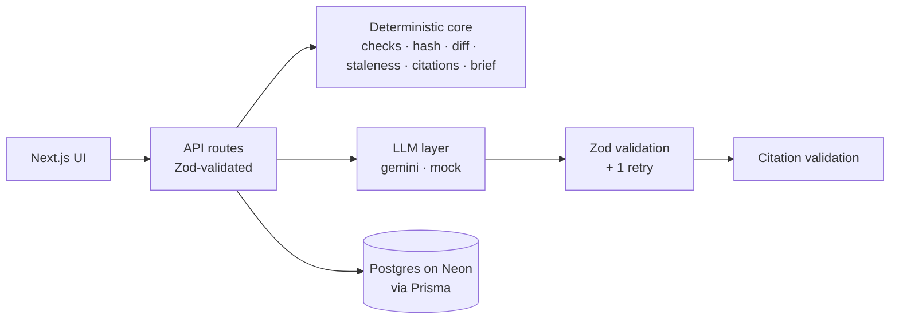

# Release Readiness

Turns a structured release package (features, fixes, changed behaviour, QA evidence, limitations, migration notes, affected groups) into a reviewed, evidence-backed readiness brief.

Deterministic checks catch missing information. An LLM drafts impact classifications, gaps, unsupported claims, risks and two summaries, and **every statement must cite package items**. A person approves each statement, and a template, not the LLM, assembles the final brief from approved statements only. Readiness can only be set by a named human.

**Live:** `<YOUR-VERCEL-URL>` (no login needed)

## Two-minute walkthrough

1. Open the app and click **Load sample** (or open "Invoices 2.4 (sample)").
2. **Checks** tab: one error (migration notes are empty) and two warnings (F-2 and C-1 have no QA coverage).
3. **AI Review** tab: click **Run analysis**. Expect:
   - "3x faster" flagged as unsupported (QA-1 says no benchmark was run).
   - The timezone fix flagged because QA only covered IST and UTC.
   - C-1 (30-minute session expiry) classified HIGH, with a gap for the missing migration or communication note.

   Hover a citation chip to see the item text. Approve a few statements, and reject or edit anything that overclaims.
4. **Brief** tab: generation is blocked, and the checklist shows why (a check error).
5. **Package** tab:
   - Change F-1 to "Bulk CSV export for invoices" (drop the claim).
   - Add M-1: "Set SESSION_IDLE_MINUTES".
   - Click **Save as new version**. The toast reports how many statements went stale.
6. **Compare** tab: v1 → v2 shows F-1 modified, M-1 added, and the statements that cite F-1 marked stale.
7. **AI Review**: stale statements are back to pending and can't be approved until edited (or re-run analysis).
8. **Brief**: generate it, then copy or download the markdown.
9. **Readiness**: enter your name, choose a decision, confirm.

**Shortcut for Compare:** open "Mobile app 5.0 (compare sample)". It already has v1 (analysed, with 11 statements approved) and v2. Compare v1 → v2 shows:
- **Changed:** F-1 modified (the "7 days" offline claim corrected to 24 hours).
- **Removed:** F-3.
- **Added:** F-4, QA-3, QA-4, L-2 and M-1.
- **Stale:** the 6 approved statements that cite F-1 or F-3, which are back to pending in v2. Statements citing only unchanged items stay approved.

Both samples are created by `npm run seed`.

## Architecture



### What is deterministic vs AI

| Deterministic (pure functions, unit-tested) | AI (validated, never trusted to decide) |
|---|---|
| Required-section, coverage, dangling-reference and ID checks (`lib/checks.ts`) | Impact classification per change |
| Item hashing and staleness carry-over (`lib/hash.ts`, `lib/staleness.ts`) | Gaps and unsupported claims |
| Version diff (`lib/diff.ts`) | Risks |
| Citation validation (`lib/citations.ts`) | Technical and stakeholder summaries |
| Brief gating and template assembly (`lib/brief.ts`) | |
| Approval and readiness (human-only API routes) | |

## Key design decisions

- **Stable IDs plus hashing.** Each item keeps its ID across versions. `hash = sha256(normalized text + sorted covers)`. Statements store the hash of each cited item at generation time. When a new version is saved, carried-over statements whose cited items changed or disappeared are marked stale with a reason ("F-1 changed") and reset to pending.
- **Versions are immutable.** Saving always creates a new version, in one transaction with its checks, hashes and carried-over statements. Reviews and readiness can only change on the latest version; older ones are read-only (`409 VERSION_LOCKED`).
- **Citation validation.** A statement citing an ID that isn't in the package is dropped and logged (`ai.citation_invalid`): citing a nonexistent item means the model invented something. Statements with no citations are kept but flagged, and must be edited before approval (GAP statements are exempt).
- **The AI cannot approve anything.** The output schemas have no status, approval or readiness fields, and unknown keys are stripped. A test feeds `"status": "APPROVED"` and `"readiness": "READY_FOR_RELEASE"` through the real analyze route and asserts nothing is approved and readiness is untouched.
- **Template-built brief.** The brief is assembled by code from APPROVED, non-stale statements (edited text wins over the AI original). It is blocked if any check error exists, any approved statement is stale, or nothing is approved.
- **Human re-confirmation of stale statements.** Editing a stale statement re-stamps its citations against the current version and clears the stale flag; approval of a stale statement is refused until then. Changing the text of an approved statement moves it back to pending.
- **Rate-limited AI.** The demo is public with no login, so `analyze` allows one run in progress per version, a 30s cooldown per version, and 30 runs per hour overall. Limits are read from the `AnalysisRun` table, not memory, because serverless instances don't share state. Over the limit, the API returns `429` with how long to wait.
- **Traceability.** Every analysis run stores model, prompt version, a hash of the prompt files, duration, status, and raw model output (including failed attempts).

## Setup

Requires Node 20+ and a Postgres database (Neon free tier works).

```bash
cp .env.example .env          # fill in DATABASE_URL; LLM_PROVIDER=mock needs no key
npm install
npx prisma migrate dev        # creates tables
npm run seed                  # sample release with a mock analysis (idempotent)
npm run dev                   # http://localhost:3000
```

| Variable | Purpose |
|---|---|
| `DATABASE_URL` | Postgres connection (pooled on Vercel) |
| `DATABASE_URL_UNPOOLED` | Direct connection, used by `prisma migrate` |
| `LLM_PROVIDER` | `gemini` or `mock` |
| `GEMINI_API_KEY` | Required when `LLM_PROVIDER=gemini` |
| `LLM_MODEL` | Defaults to `gemini-2.5-flash` |
| `ANALYZE_COOLDOWN_SECONDS` | Per-version cooldown between analysis runs (default 30) |
| `ANALYZE_MAX_PER_HOUR` | Analysis runs allowed per hour across the whole app (default 30) |

**Mock mode** (`LLM_PROVIDER=mock`) returns deterministic, rule-based output that finds the planted problems in the sample. Tests and CI use it; no key is needed.

## Tests

```bash
npm test          # Vitest
npm run lint
npm run typecheck
```

| File | Covers |
|---|---|
| `checks.test.ts` | Missing sections, explicit "None", blank text, no changes, uncovered items, dangling covers, duplicate and empty IDs, planted problems in the sample |
| `staleness.test.ts` | Unchanged stays fresh; whitespace edits ignored; changed, removed, or edited covers make it stale and PENDING; rejected statements dropped; inputs not mutated |
| `diff.test.ts` | Added, removed, modified, unchanged; word diff; covers changes |
| `citations.test.ts` | Unknown IDs drop the statement; hashes stamped; uncited flagged (except GAP) |
| `aiParse.test.ts` | Valid and fenced JSON; retry with the error then success; two failures produce a FAILED run with raw output; timeout produces a FAILED run; injected `status` is stripped |
| `brief.test.ts` | Only approved, non-stale statements; edited text used; blocked by check errors, stale approvals, or no approvals; deterministic output |
| `rateLimit.test.ts` | In-progress run blocks, cooldown with wait time, hourly cap |
| `api.readiness.test.ts` | Reviewer name and confirmation required; unknown fields rejected; old versions locked; error shape; analyze never writes readiness even when the model asks |

CI (`.github/workflows/ci.yml`) runs lint, typecheck and tests on every push.

## Scope

**Done:** release packages with versioning, deterministic checks, AI analysis and summaries with citations, human review (edit, approve, reject), staleness across versions, version compare, gated template brief, human-only readiness, structured logging, tests, CI.

**Excluded:** Git or issue-tracker integration, deployment and rollback automation, publishing the brief anywhere, authentication, multi-user collaboration.

## Limitations

- No auth: a single reviewer is assumed, and the reviewer name is self-declared.
- LLM classification is non-deterministic between runs (temperature 0 reduces but does not remove variation). Human review is the control.
- Staleness is item-level, not sentence-level: any change to a cited item marks the statement stale, even if the statement still holds.
- Citation validation proves a cited item exists, not that it supports the statement. That is what human review is for.
- English only.
- Neon free tier scales to zero, so the first request after idle can take about a second longer.

## Deployment (Vercel + Neon)

1. Push to GitHub and import the repo into Vercel.
2. Add the Neon integration, or set the variables by hand: `DATABASE_URL` (pooled), `DATABASE_URL_UNPOOLED` (direct).
3. Set `LLM_PROVIDER=gemini`, `GEMINI_API_KEY`, and `LLM_MODEL`.
4. Vercel runs the `vercel-build` script: `prisma migrate deploy && next build`.
5. `vercel.json` pins functions to `sin1` (Singapore), the same region as the database.
6. Seed once from your machine: `npm run seed` with `.env` pointing at the production database.

## Logging

pino JSON logs, with a `requestId` on every request (also returned as the `x-request-id` header). Events:

- Releases and versions: `release.created`, `version.created` (with stale count), `checks.completed`
- AI runs: `ai.run.started`, `ai.run.succeeded` or `ai.run.failed` (with model, prompt version, duration and token usage), `ai.validation_retry`, `ai.citation_invalid`
- Review and decisions: `statement.reviewed`, `brief.generated`, `brief.blocked` (with reasons), `readiness.set`

API keys are never logged.
